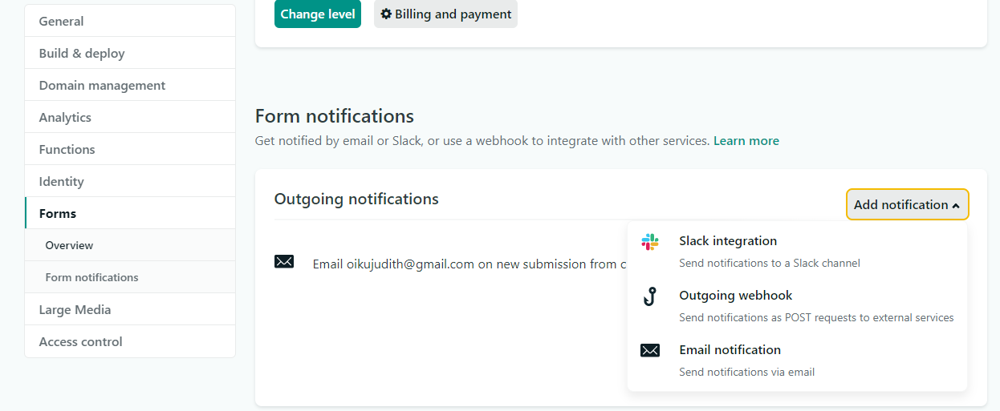
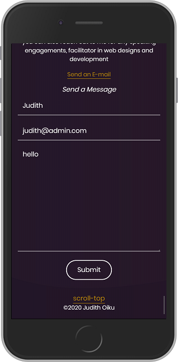
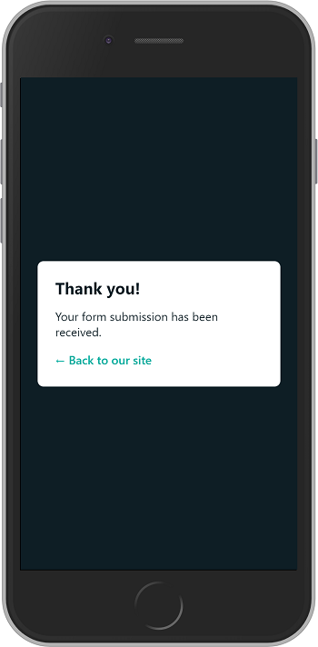
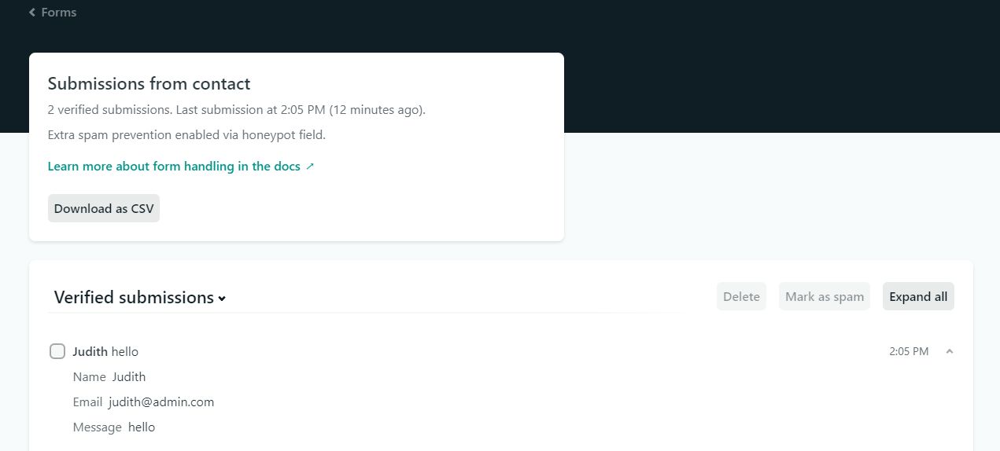
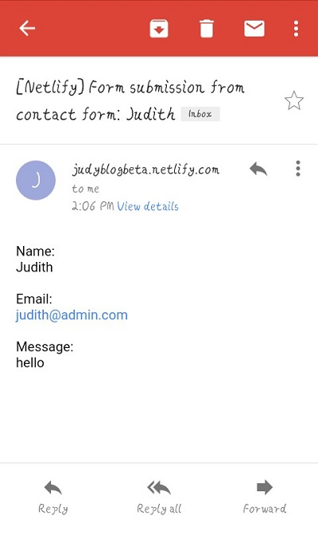

 
Setting up a contact form in your website using netlify is pretty easy,  but there is a little variation when it comes to [Gatsbyjs](https://www.gatsbyjs.org/). 

There are couple of services you can use like [Getform](https://getform.io/),  [Formspree](https://formspree.io/), but in this tutorial,  we are going to be using [netlify forms](https://docs.netlify.com/forms/setup/).

 To learn how to use Getforms and Formspree in Gatsbyjs,  [Gatsbyjs documentation](https://www.gatsbyjs.org/docs/building-a-contact-form/#creating-an-accessible-form) got you covered. 

**Steps**

How then can we use netlify,  we can do this by adding a few attribute . Let's look at the sample code below,  assuming you have a contact form like so:


``` html

<form name ="myform" method="POST" data-netlify="true" netlify-honeypot="bot-field"/>
<input type="hidden" name ="bot-field"/>
<input type="text" name ="name" placeholder="my name"/> 
<input type="email" name ="email" placeholder="name@name.com"/> 
<textarea name="message" placeholder="type in your message">
<div data-netlify-captcha></div>
<input type="submit" value ="Submit"/> 
</form>

```
adding the
`data-netlify="true"`  `netlify_honeypot="bot-field"` 
attributes is what you need to start collecting submissions from your contact form 

 `myform` is the name of your form and that is what you will use to identify your form in your netlify dashboard. `data-netlify-captcha` 
for spam filtering.


> personally I had to include `data-netlify-captcha` before I was able to see the confirmation success message
 

modifying your form with the above sample code is  basically all you need to get your Gatsby contact form up and running, to see it in effect,  **commit changes**,  **deploy**, and **run your live website**

Before we fill the form,  let's activate our netlify dashboard to send the contact details to an email address.


Navigating the netlify dashboard ,  under **production deploys**, under the **Recent form submissions** your netlify form is active, which confirms your contact form is ready to collect submissions and if you already have a submission,  you get to see it also. 

**How then can you get the details via mail** 

- Navigate to settings
- Click on forms, on the form notifications tab
- Click on add notification ,  there you get the various channels in which you can get notified. 
- Select your suitable option. If you choose the email option, you will be prompted to enter your email address and the name of the contact form
-  Click save.



**Testing it out**
- Fill out your contact information



- click submit
-  you should see a confirmation success message pop-up redirecting you back to your website. 



- Go back to your netlify dashboard to get your details,  and also check your email. 


> you only get 100 submissions / month on a free plan







That is it everyone,  more information about netlify forms  can be found on their [documentation](https://docs.netlify.com)